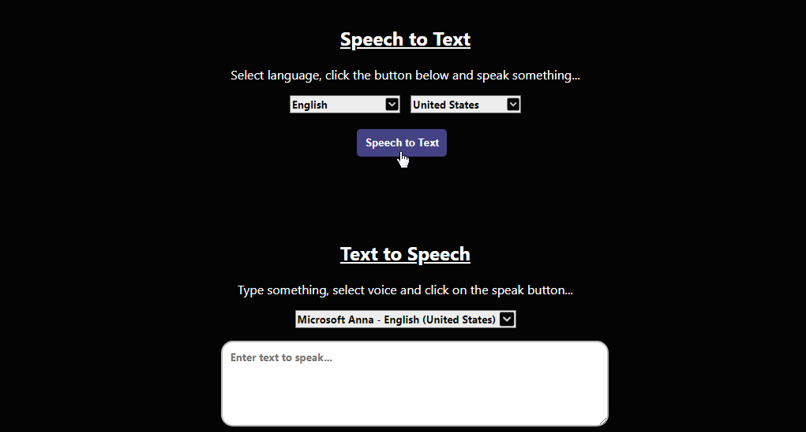
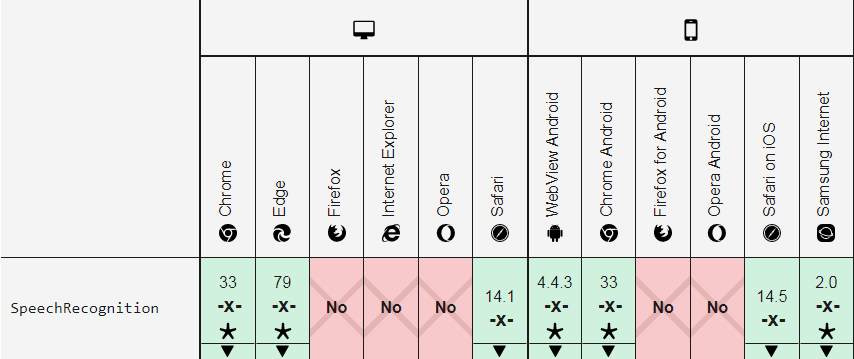
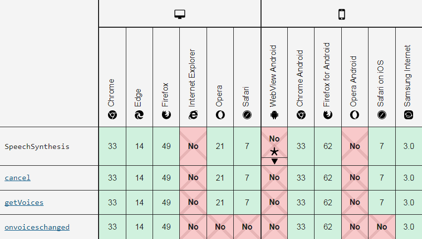

# Speech <> Text
[](https://github.com/AyushShahh/web-speech-synthesis-and-recognition/blob/main/LICENSE)
[](https://hits.seeyoufarm.com)
[](https://github.com/AyushShahh/web-speech-synthesis-and-recognition/stargazers)
[](https://github.com/AyushShahh/web-speech-synthesis-and-recognition/network)
[](https://github.com/AyushShahh/web-speech-synthesis-and-recognition/issues)


[](https://twitter.com/intent/tweet?text=Woah!%20Check%20this%20out&url=https%3A%2F%2Fgithub.com%2FAyushShahh%2Fweb-speech-synthesis-and-recognition)

Convert Speech to Text and vice versa in seconds.<br>
Check the live website: [https://speechtotextt.netlify.app](https://speechtotextt.netlify.app)<br>

<br>

## How to use?
**Speech to text**
- Select a language and dialect for conversion
- Click on the speak button
- Allow the browser to access your microphone
- Start speaking

**Text to speech**
- Select voice for speech synthesis
- Type anything you want to convert to speech
- Press speak button and turn on your volume

## Local Development
Clone this repository and you will be able to run this on your localhost
```
git clone https://github.com/AyushShahh/web-speech-synthesis-and-recognition.git
```

## API used
Javascript Web Speech API<br>
[MDN Documentation](https://developer.mozilla.org/en-US/docs/Web/API/Web_Speech_API), [W3C Documentation](https://wicg.github.io/speech-api/) <br>

## Supported browsers
This API is native to chromium browsers.




## License
This project is licensed under the **MIT License**. See the **[LICENSE](https://github.com/AyushShahh/web-speech-synthesis-and-recognition/blob/main/LICENSE)** file for details.
